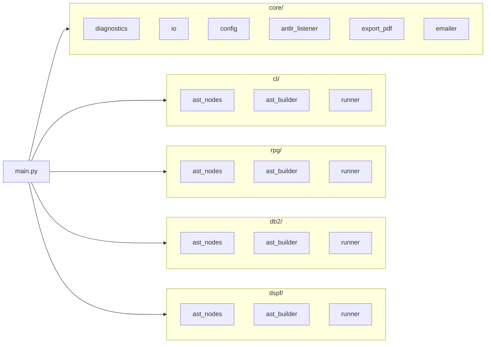

# IBM i Artifact Parser – Mermaid Diagrams

Copy these Mermaid code blocks into Markdown to render the diagrams.

---

## 7.1 High-level modular architecture

```mermaid
flowchart TD
    A[Inputs: CL / RPG / DB2 / DSPF] --> B[File Classifier (auto or explicit)]

    B --> C1[CL Module<br/>parse_cl -> Cl AST]
    B --> C2[RPG Module<br/>parse_rpg -> Rpg AST]
    B --> C3[DB2 Module<br/>parse_db2 -> Db2 AST]
    B --> C4[DSPF Module<br/>parse_dspf -> Dspf AST]

    C1 --> D[Per-module Results]
    C2 --> D
    C3 --> D
    C4 --> D

    D --> E[Combined Pipeline Aggregator<br/>run_pipeline]
    E --> F[PipelineResult<br/>ASTs + Diagnostics + Summaries]
```

---

## 7.2 Per-language parsing flow (example: RPG)

```mermaid
flowchart TD
    A[RPG Source (fixed / free)] --> B[Speedy ANTLR Lexer]
    B --> C[Speedy ANTLR Parser]
    C --> D[Parse Tree]
    D --> E[AstBuilder Visitor/Listener]
    E --> F[RpgProgram AST]
    F --> G[Per-language Runner<br/>run_rpg_file]
```

---

## 7.3 Combined run_pipeline path

```mermaid
flowchart TD
    A[run_pipeline(inputs, mode)] --> B[Determine mode]
    B -->|auto| C[Infer kind per file]
    B -->|explicit| D[Use kind from InputSpec]

    C --> E[Dispatch to CL/RPG/DB2/DSPF modules]
    D --> E

    E --> F[Collect ASTs & Diagnostics]
    F --> G[Cross-linking optional]
    G --> H[PipelineResult]
```

---

## Package structure


